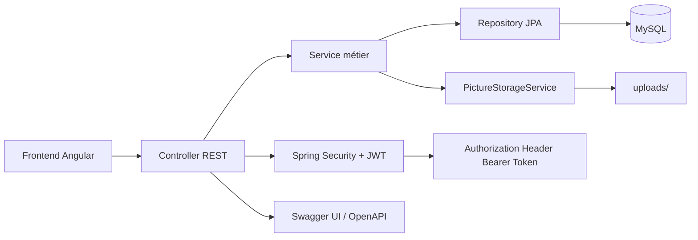

# Architecture du backend Chatop

Ce document fournit une vue d’ensemble technique du backend Spring Boot, son organisation en couches, son flux de traitement et ses points d’intégration.

## 1. Vue d’ensemble

Le backend est une application REST développée avec Spring Boot, Spring Security et JWT.

L’application suit une architecture en couches claire et maintenable :

- `controllers` : réception des requêtes HTTP et exposition des endpoints
- `services` : logique métier et orchestration des traitements
- `repositories` : accès à la base via Spring Data JPA
- `models` : entités JPA représentant les tables MySQL
- `dto` : objets de transfert utilisés pour sécuriser les échanges API
- `exceptions` : gestion centralisée des erreurs métier et techniques
- `configuration` : sécurité, CORS, OpenAPI/Swagger, JWT et stockage des fichiers

## 2. Diagramme architectural



## 3. Arborescence du projet

```text
OC-P3-Backend/
├── src/
│   ├── main/
│   │   ├── java/com/chatop/api/
│   │   │   ├── ApiApplication.java
│   │   │   ├── configuration/
│   │   │   │   ├── CorsConfig.java
│   │   │   │   ├── JwtConfig.java
│   │   │   │   ├── OpenApiConfig.java
│   │   │   │   ├── SecurityConfig.java
│   │   │   │   └── WebConfig.java
│   │   │   ├── controllers/
│   │   │   │   ├── AuthController.java
│   │   │   │   ├── MessageController.java
│   │   │   │   ├── RentalController.java
│   │   │   │   └── UserController.java
│   │   │   ├── dto/
│   │   │   │   ├── LoginDto.java
│   │   │   │   ├── MessageRequestDto.java
│   │   │   │   ├── RegisterDto.java
│   │   │   │   ├── RentalCreateRequestDto.java
│   │   │   │   ├── RentalDetailResponseDto.java
│   │   │   │   ├── RentalListResponseDto.java
│   │   │   │   ├── RentalUpdateRequestDto.java
│   │   │   │   ├── TokenResponseDto.java
│   │   │   │   └── UserResponseDto.java
│   │   │   ├── exceptions/
│   │   │   │   ├── FileStorageException.java
│   │   │   │   ├── GlobalExceptionHandler.java
│   │   │   │   ├── JwtAuthenticationEntryPoint.java
│   │   │   │   └── ResourceNotFoundException.java
│   │   │   ├── models/
│   │   │   │   ├── MessageEntity.java
│   │   │   │   ├── RentalEntity.java
│   │   │   │   └── UserEntity.java
│   │   │   ├── repositories/
│   │   │   │   ├── MessageRepository.java
│   │   │   │   ├── RentalRepository.java
│   │   │   │   └── UserRepository.java
│   │   │   └── services/
│   │   │       ├── CustomUserDetailsService.java
│   │   │       ├── JWTService.java
│   │   │       ├── MessageService.java
│   │   │       ├── PictureStorageService.java
│   │   │       ├── RentalService.java
│   │   │       └── UserService.java
│   │   └── resources/
│   │       ├── application.properties
│   │       └── META-INF/additional-spring-configuration-metadata.json
│   └── test/java/com/chatop/api/
│       └── ApiApplicationTests.java
├── uploads/
├── local.properties.example
├── script.sql
├── pom.xml
├── mvnw
├── README.md
└── ARCHITECTURE.md
```

## 4. Rôle des fichiers principaux

### `ApiApplication.java`

Point d’entrée principal de l’application Spring Boot.
Il lance le contexte Spring et active la configuration de l’application.

### `configuration/`

Ce package contient les configurations système.

- `SecurityConfig.java` : configure Spring Security, les règles d’accès HTTP, les endpoints publics et JWT.
- `JwtConfig.java` : crée les beans pour signer et valider les tokens JWT.
- `OpenApiConfig.java` : configure Swagger/OpenAPI.
- `CorsConfig.java` : active la configuration CORS pour accepter les appels du frontend.
- `WebConfig.java` : configure l’accès aux ressources statiques/images.

### `controllers/`

Les controllers exposent les endpoints REST.

- `AuthController.java` : gère `register`, `login` et `me`.
- `MessageController.java` : gère l’envoi de messages.
- `RentalController.java` : gère la création, la consultation et la mise à jour des locations.
- `UserController.java` : gère la récupération d’un utilisateur.

Chaque controller reçoit une requête HTTP, valide les paramètres ou le body, puis délègue le traitement au service métier.

### `services/`

Cette couche contient la logique métier.

- `UserService.java` : inscription, récupération d’utilisateur, gestion du mot de passe haché.
- `RentalService.java` : création et mise à jour des locations, récupération des rentals.
- `MessageService.java` : enregistrement des messages liés à une location.
- `JWTService.java` : génération du token JWT à partir de l’authentification Spring Security.
- `CustomUserDetailsService.java` : chargement de l’utilisateur depuis la base pour l’authentification.
- `PictureStorageService.java` : enregistre les images uploadées sur le disque local et retourne leur URL publique.

### `repositories/`

Ce package contient les interfaces Spring Data JPA.

- `UserRepository.java` : requêtes liées aux utilisateurs.
- `RentalRepository.java` : requêtes liées aux locations.
- `MessageRepository.java` : requêtes liées aux messages.

### `models/`

Ce package contient les entités JPA :

- `UserEntity.java` : table utilisateur.
- `RentalEntity.java` : table location.
- `MessageEntity.java` : table message.

Ces classes représentent les tables MySQL et sont mappées par JPA.

### `dto/`

Les DTO sont utilisés pour séparer l’API de l’entité JPA.

Ils servent à :

- valider les données entrantes
- ne pas exposer directement les entités JPA
- structurer la réponse HTTP de façon claire

Examples :

- `RegisterDto` pour l’inscription
- `LoginDto` pour la connexion
- `RentalCreateRequestDto` pour la création d’un rental
- `TokenResponseDto` pour la réponse JWT
- `UserResponseDto` et `RentalDetailResponseDto` pour les réponses API

### `exceptions/`

Ce package centralise la gestion des erreurs.

- `GlobalExceptionHandler.java` : intercepte les exceptions et renvoie des réponses HTTP explicites.
- `ResourceNotFoundException.java` : exception métier pour une ressource absente.
- `FileStorageException.java` : exception pour les erreurs de stockage de fichiers.
- `JwtAuthenticationEntryPoint.java` : répond proprement en cas d’échec JWT.

### `resources/application.properties`

Ce fichier contient la configuration Spring Boot générale.

Il définit notamment :

- le port serveur
- le dossier d’upload
- l’URL de base des images
- la configuration CORS
- le chargement de `local.properties`

## 5. Flux de fonctionnement de l’application

### Résumé (TL;DR)

Le backend fonctionne comme suit :

- le frontend envoie des requêtes HTTP à l’API
- le controller réceptionne la requête
- le service applique la logique métier
- le repository accède à MySQL via JPA
- les réponses sont transformées en DTO
- Spring Security protège les endpoints sensibles avec JWT

### Inscription

1. Le client appelle `POST /api/auth/register`.
2. `AuthController` reçoit la requête.
3. Le `UserService` vérifie que l’email n’existe pas déjà.
4. Le mot de passe est hashé avec BCrypt.
5. L’utilisateur est sauvegardé en base.
6. L’authentification Spring Security est lancée.
7. Un JWT est généré par `JWTService`.
8. Le backend retourne ce token au frontend.

### Connexion

1. Le client envoie `POST /api/auth/login` avec email et mot de passe.
2. `AuthenticationManager` vérifie les identifiants.
3. Si validés, `JWTService` génère un token JWT.
4. Le frontend stocke le token pour les appels authentifiés.

### Accès aux routes protégées

1. Le frontend ajoute le header `Authorization: Bearer <token>`.
2. `SecurityConfig` vérifie la présence et la validité du token.
3. Si le token est valide, la requête passe.
4. Sinon, `JwtAuthenticationEntryPoint` renvoie une erreur `401`.

### Création d’une location

1. Le frontend appelle `POST /api/rentals` avec un formulaire multipart.
2. Le `RentalController` reçoit la requête.
3. L’utilisateur authentifié est récupéré depuis le JWT.
4. `PictureStorageService` enregistre l’image sur le disque.
5. Le service construit l’entité `RentalEntity`.
6. La location est enregistrée en base avec l’URL de l’image.

### Envoi d’un message

1. Le client appelle `POST /api/messages`.
2. Le controller récupère l’utilisateur connecté via le JWT.
3. Le `MessageService` enregistre le message dans la table `message`.

## 6. Sécurité du projet

Le backend applique les bonnes pratiques suivantes :

- accès public limité aux endpoints d’authentification et à Swagger
- token JWT requis pour l’accès aux endpoints sécurisés
- mots de passe chiffrés avec BCrypt
- configuration sensible externalisée dans `local.properties`
- gestion centralisée des erreurs HTTP par `GlobalExceptionHandler`

## 7. Documentation Swagger

La documentation OpenAPI est configurée dans `OpenApiConfig.java`, elle offre :

- une page Swagger UI interactive
- une description des endpoints
- la gestion de l’authentification JWT depuis l’interface Swagger

## 8. Fichiers importants à retenir

- `pom.xml` : dépendances Maven et configuration du projet
- `application.properties` : configuration Spring Boot
- `local.properties` : secrets locaux MySQL + JWT
- `SecurityConfig.java` : protection des routes
- `OpenApiConfig.java` : documentation Swagger
- `GlobalExceptionHandler.java` : gestion uniforme des erreurs
